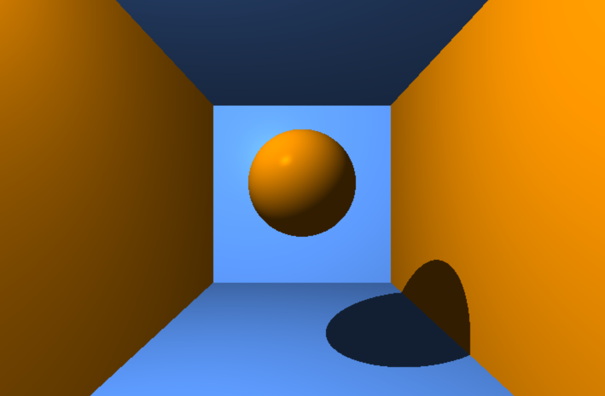
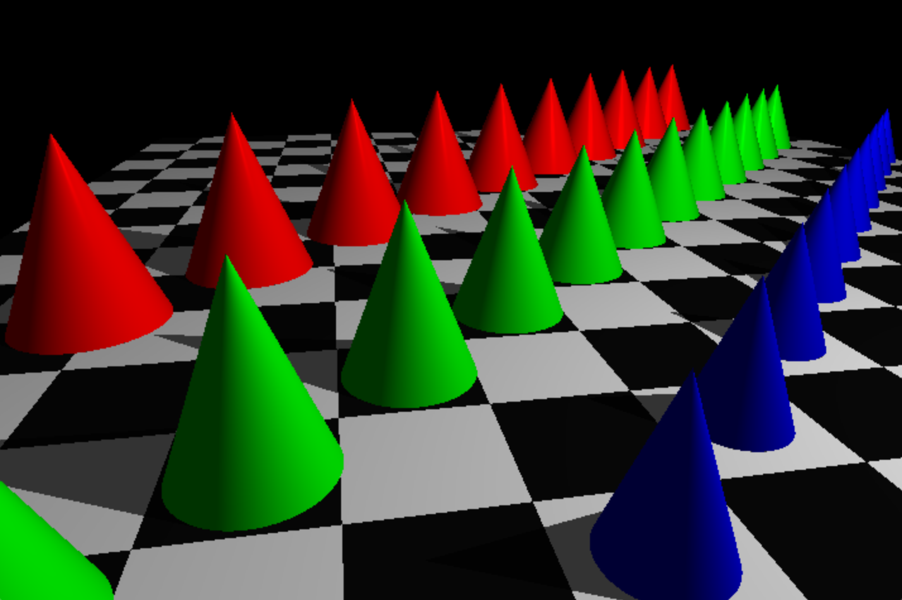
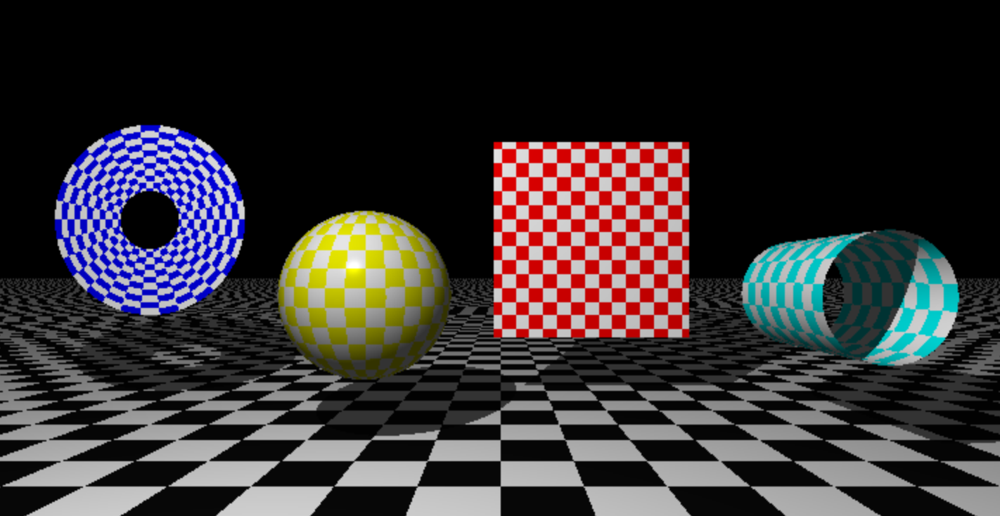
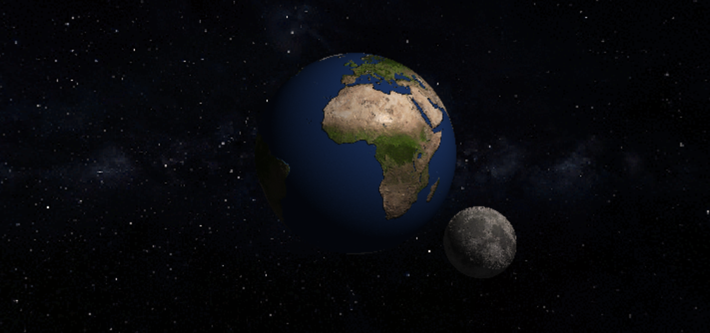
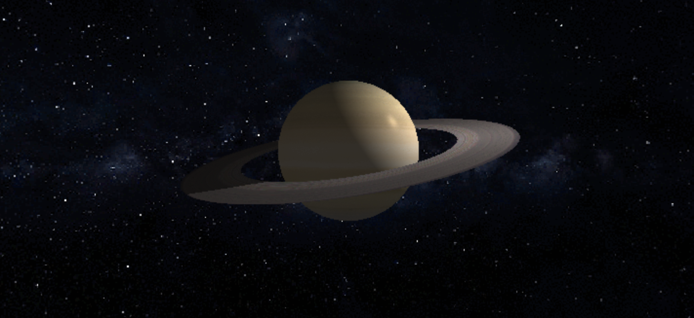
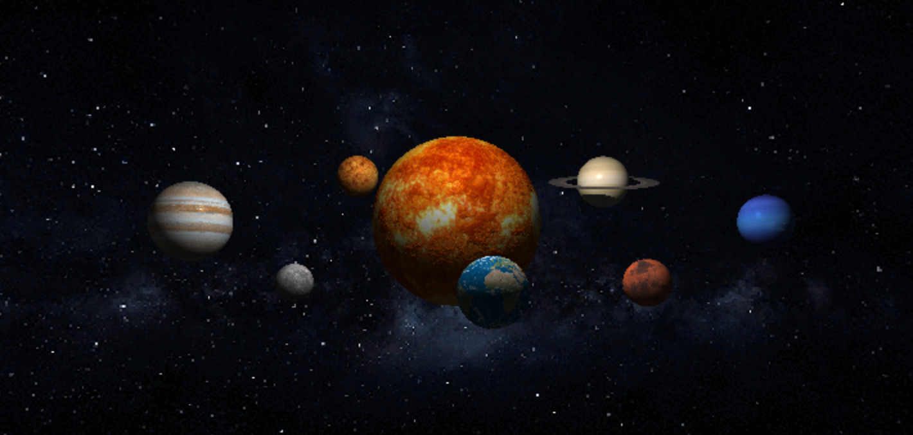

# miniRT

Project done with [rcollas](https://github.com/rcollas)

*[Subject]*
The goal of the program is to generate images using the Raytracing protocol.
Those computer-generated images will each represent a scene, as seen from a specific
angle and position, defined by simple geometric objects, and each with its own lighting
system.

 

## Usage

### miniRT
- cd miniRT
- make
- ./webserv scenes/*some_scene*

### miniRT_bonus
- cd miniRT_bonus
- make
- ./webserv_bonus scenes_bonus/*some_scene*

 

## Examples

*scenes/plan.rt*

*scenes_bonus/multi.rt*

*scenes_bonus/checker.rt*

*scenes_bonus/earth.rt*

*scenes_bonus/saturn.rt*

*scenes_bonus/solar_system.rt*
